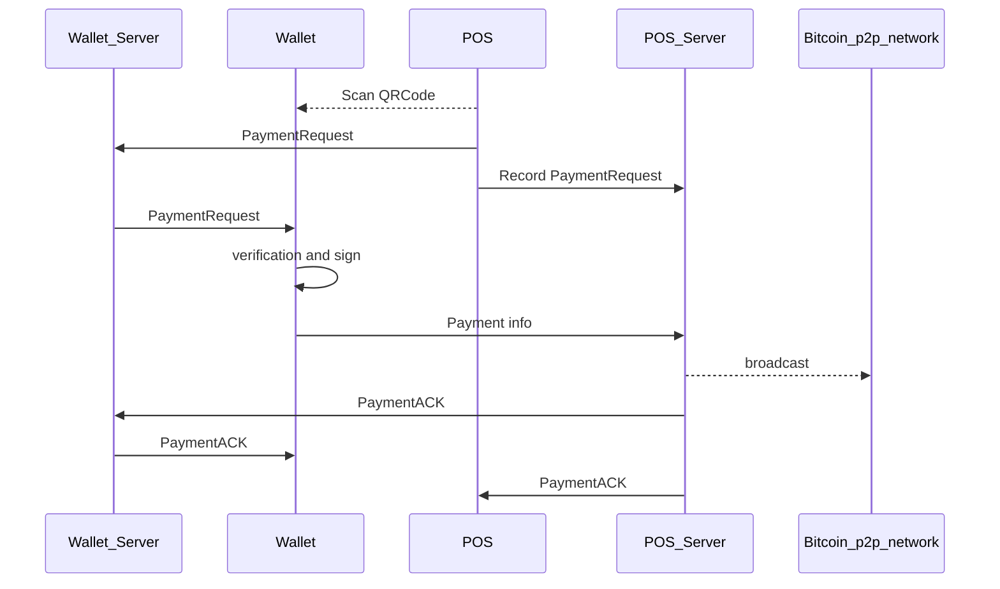

# Show&Pay Protocol Introduction


| brfc         | title             | authors     | **version** |
| ------------ | ----------------- | ----------- | ----------- |
| 3065510ee0dd | Show&Pay protocol | ShowPayTeam | 1           |

​		At present, most of the payment scenario of the cryptocurrency  in the real world is that the merchant displays the QR code, and the customer obtains the  address of the merchant by scanning, then the customer enters the number of the total price, and then the customer completes the transaction generation and broadcasts it to blockchain network. The merchant receives the specific transaction by syncing form the blockchain network  to complete the whole  asset transfer process.

​		 There seems to be no problem , but in fact, there are many security risks. 
1. For the merchants, they need to expose their bitcoin address, that is not security enough for the merchants. 
2. Since 0-conf payment can be accepted in BSV, it is better that the transaction is broadcasted by the merchants rather then the customers.
3. The scenario described above is not a peer to peer transcation, it's performance is bad when the transaction volume becomes large
4. Moreover, this is very unfriendly to the customers, the customers need a lot of tedious actions

​		In order to solve these problems we design a new protocol based on the [**bip270**](https://github.com/moneybutton/bips/blob/master/bip-0270.mediawiki) and we call it **"Show&Pay"** method.

​		We want to define the roles  involve first, there are four roles: for the customers side we call it "Wallet", the server which provides the services for the wallet we call it "Wallet Server", for the merchant side we call it "POS", and the server which provides the services for the POS we call it "POS Server".

#### **An ideal payment scenario should be like this.：**

> Customers show their QR code, merchants use POS device to scan, customers make  confirmation (or automatically confirm for small amount), and the payment is done.

​		That's the Show&Pay payment method


#### **Protocol and the process：**



##### 1. First, the  wallet generates its own payment QR code. The encoding content is

```
featureCode,paymentUrl,walletId,tokenIndex,random,hash
```


|             |                                                              |
| ----------- | ------------------------------------------------------------ |
| featureCode | featureCode always set to "show&pay:"                                           |
| paymentUrl  | the wallet service URL                                              |
| walletId    | the wallet identity (used for identifying wallet)              |
| tokenIndex  | default is 0 for BSV, and the other index number is for promissory tokens（range 0-255） |
| random      | random string for preventing double spendind. string, length 6             |
| hash        | SHA256(featureCode,paymentUrl,walletId,tokenIndex,random).substring(0, 12);  Take the first 12 characters of the Bitcoin-style display hash |

Below is the example:

```
show&pay:https://www.showpay.com,wallet1,0,HU8N09,61598386dc54
```

##### 2. When the POS device receives the  data, it should generate the Output data

```
Output {
  amount 			// number. required.
  script 			// string. required. hexadecimal script.
  description // string. optional. must not have JSON string length of greater than 100.
  tokenIndex // number token_index. default 0, 0 means bsv 
}
```


|             |                                           |
| ----------- | ----------------------------------------- |
| amount      | Number of satoshis (0.00000001 BSV) to be paid.          |
| script      | A "TxOut" script where payment should be sent, formatted as a hexadecimal string. |
| description | An optional description such as "tip" or "sales tax". Maximum length is 50 characters.            |
| tokenIndex  | default is 0 for BSV, and the other index number is for promissory tokens（range 0-255）                               |

##### 3. The POS returns the PaymentRequest to the Wallet Server, and at the same time the POS Server should record the PaymentRequest.

```
PaymentRequest {
    network 					// string. required. always set to "bitcoin".
    outputs 					// an array of outputs. required, but can have zero elements.
    walletId 					// string.  required. wallet-device  
    deviceId 					// string.  required. pos-device
    creationTimestamp // number. required.
    expirationTimestamp // number. optional.
    memo 								// string. optional.
    paymentUrl 					// string. required.
    merchantData 				// string. optional.
    qrcodeLabelData 		// string. optional.
}
```

|                     |                                                              |
| ------------------- | ------------------------------------------------------------ |
| network             | This field is required and always set to "bitcoin". If set to any other value besides "bitcoin", no wallet should process the payments. For test purposes, one can set this field to "test" which will ensure that no wallet will accidentally send a payment to what might be invalid or test addresses. |
| outputs             | One or more outputs where Bitcoins are to be sent.           |
| creationTimestamp   | Unix timestamp (seconds since 1-Jan-1970 UTC) when the PaymentRequest was created. |
| expirationTimestamp | Unix timestamp (UTC) after which the PaymentRequest should be considered invalid. |
| memo                | Note that should be displayed to the customer, explaining what this PaymentRequest is for. Maximum length is 50 characters. |
| paymentUrl          | Secure HTTPS location where a Payment message (see below) will be sent to obtain a PaymentACK. Maximum length is 4000 characters. |
| merchantData        | Arbitrary data that may be used by the payment host to identify the PaymentRequest. May be omitted if the payment host does not need to associate Payments with PaymentRequest or if they associate each PaymentRequest with a separate payment address. Maximum length is 10000 characters. |
| walletId            | Wallet identity (used for identifying wallet in Wallet Server) |
| deviceId            | Device identity (used for identifying device in POS Server)  |
| qrcodeLabelData     | Random string in qrcode                                      |

##### 4. Return the Payment to the POS Server

Payment messages are sent after the customer has authorized payment(this may be automatic authorized if  small amount ), the Payment should return to the POS Server

```
Payment {
  walletId 					// string.  required. wallet-device  
  deviceId 					// string.  required. pos-device
  merchantData 	// string. optional.
  transaction 	// a hex-formatted (and fully-signed and valid) transaction. required.
  refundTo 			// string. paymail to send a refund to. optional.
  memo 					// string. optional.
}
```

|              |                                                              |
| ------------ | ------------------------------------------------------------ |
| walletId     |the wallet identity (used for identifying wallet in Wallet Server)               |
| deviceId     | the Device identity (used for identifying device in POS Server)                |
| merchantData | copied from PaymentDetails.merchantData. Payment hosts may use invoice numbers or any other data they require to match Payments to PaymentRequests. Note that malicious clients may modify the merchantData, so should be authenticated in some way (for example, signed with a payment host-only key). Maximum length is 10000 characters. |
| transaction  | A valid, signed Bitcoin transaction that fully pays the PaymentRequest. The transaction is hex-encoded and must NOT be prefixed with "0x". |
| refundTo     | A paymail to send a refund to should a refund be necessary. Maximum length is 100 characters.             |
| memo         | A plain-text note from the customer to the payment host.                                     |


##### 5.POS side broadcasts the transaction

PaymentACK  is sent from the POS server to the  wallet in response to a Payment message:

```
PaymentACK {
    payment // Payment. required.
    memo 		// string. optional.
    error 	// number. optional.
}
```

|         |                                                              |
| ------- | ------------------------------------------------------------ |
| payment | Copy of the Payment message that triggered this PaymentACK. Clients may ignore this if they implement another way of associating Payments with PaymentACKs. |
| memo    | Note that should be displayed to the customer giving the status of the transaction                                           |
| error   | A number indicating why the transaction was not accepted. 0 or undefined indicates no error. A 1 or any other positive integer indicates an error. The errors are left undefined for now; it is recommended only to use "1" and to fill the memo with a textual explanation about why the transaction was not accepted until further numbers are defined and standardized. |

##### 6. POS Server reponse the callback of the wallet

The POS Server return the payment result to the wallet client

```
PaymentResult {
  code 						// int.
  transaction // broadcast txid.
  error						// broadcast error message  
}
```


|                 |                               |
| --------------- | ----------------------------- |
| code            | the status of broadcasting, 0 means success, not 0 means failure. |
| transactionHash | return the tx hash if succeed           |
| error           | return the error message if fail   |

Wallet software sending Payment messages via HTTPS must set appropriate Content-Type and Accept headers, as specified in BIP 271:

```
Content-Type: application/bitcoinsv-payment
Accept: application/bitcoinsv-paymentack
```

When the POS Server receives the Payment message, it must determine whether or not the transaction satisfies conditions of payment. If and only if they do, it should broadcast the transaction to the the Bitcoin p2p network.


#### References

[BIP 0071](https://github.com/bitcoin/bips/blob/master/bip-0071.mediawiki) : Payment Protocol mime types

[BIP 0072](https://github.com/bitcoin/bips/blob/master/bip-0072.mediawiki) : Payment Protocol bitcoin: URI extensions

[BIP 0270](https://github.com/moneybutton/bips/blob/master/bip-0270.mediawiki) : Payment Protocol

[BIP 0270](https://github.com/moneybutton/bips/blob/master/bip-0270.mediawiki) : Payment Protocol

#### Reference implementation

[ShowMoneyPOSService](https://github.com/showMoneyapp/ShowMoneyPOSService.git
): POSService Simple Code
[ShowMoneyWalletService](https://github.com/showMoneyapp/ShowMoneyWalletService.git):WalletService Simple Code


